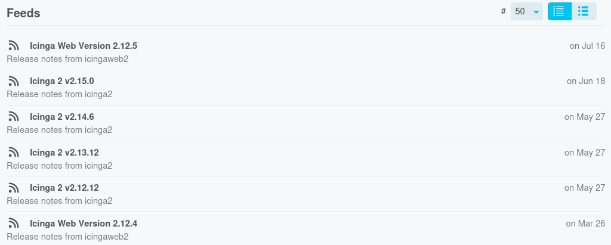

# Icinga Web Feeds

Icinga Web Module for web feeds like RSS or Atom.

## Features

* Supports RSS, JSONFeed and Atom feeds
* Dashboards for specific feeds
* Combined feed for all configured feeds

Note that this is not intended to be a full-featured feed reader.

## Installation Requirements

* PHP version ≥ 8.1

## Documentation

Documentation for this module is available at [doc](doc/).
